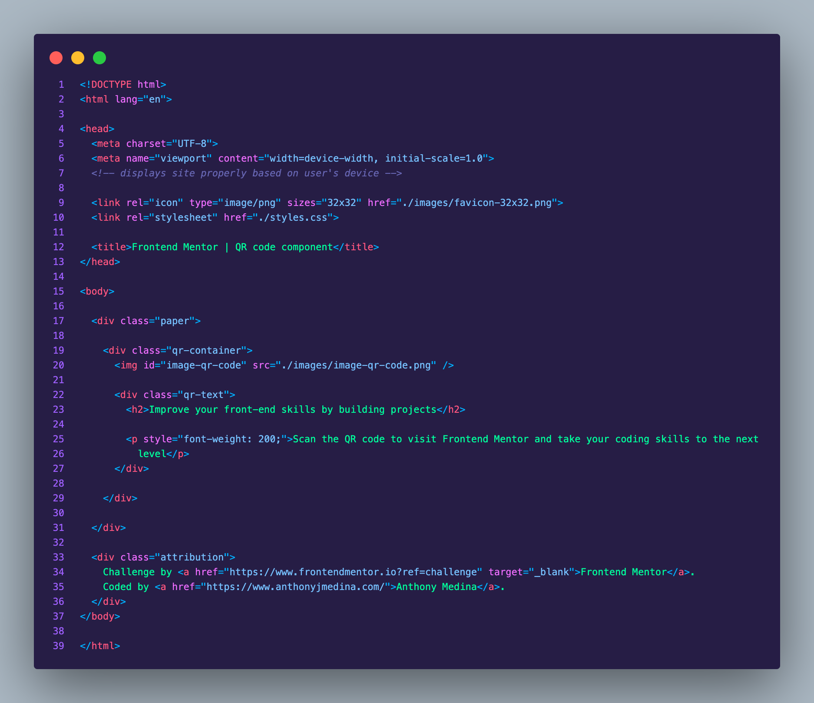

# Frontend Mentor - QR code component solution

This is my solution to the [QR code component challenge on Frontend Mentor](https://www.frontendmentor.io/challenges/qr-code-component-iux_sIO_H).

## Table of contents

- [Overview](#overview)
  - [Screenshot](#screenshot)
  - [Links](#links)
- [My process](#my-process)
  - [Built with](#built-with)
  - [What I learned](#what-i-learned)
- [Author](#author)

## Overview

### Screenshot

This is my completed component.


### Links

- Solution URL: [https://github.com/ajm24027/frontendmentor-qr-code](https://github.com/ajm24027/frontendmentor-qr-code)
- Live Site URL: [https://medina-qr-code-component.netlify.app/](https://medina-qr-code-component.netlify.app/)

## My process

### Built with

- Semantic HTML5 markup
- CSS custom properties
- Flexbox
- Mobile-first workflow

Below are the code snips of my Style and Index Files:




### What I learned

One thing that I learned that I didn't know before was the math behind nested border-radii. While in SWE Bootcamp, I was looking for some magical property to do it but it comes down to hard math as shown here -
[Random Cloud Four Article I found online](https://cloudfour.com/thinks/the-math-behind-nesting-rounded-corners/).

```--outer-radius: 1em;
--padding: 0.5em;
--inner-radius: calc(var(--outer-radius) - var(--padding));
```

## Author

- Website - [anthonyjmedina.com](https://www.your-site.com)
- Frontend Mentor - [@ajm24027](https://www.frontendmentor.io/profile/ajm24027)
- GitHub - [@ajm24027](https://github.com/ajm24027)
